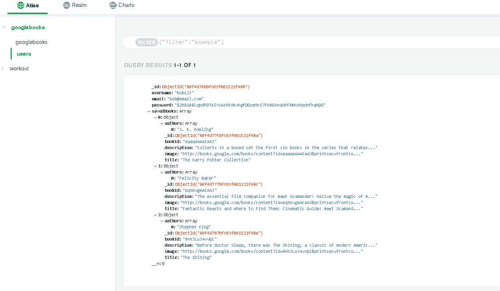
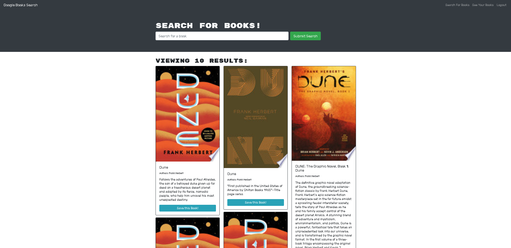

# MERN-Book-Search-Engine
Visit the deployed site!
Heroku Deployed Site: https://mern-googlebook-library.herokuapp.com/

License 
## Table of Contents 
   * [Description](#description)
   * [Installation](#installation)
   * [Usage](#usage)
   * [License](#license)
   * [Demo](#demo)
   * [Database](#database)
   * [Application](#application)
   * [Questions](#questions)

## Description 

The Book search engine is an application that uses the complete MERN stack, including a React front end, a MongoDB database, and a Node.js/Express.js server and Restful-API. It is configured to allow users to store book searches to the back end. The app is created with Google Books API search engine, GraphQL API, and Apollo Server.

## Installation

    npm i

## Usage
How to use 
User can  visit the deployed site launched through Heroku to create an account, using google third party api can search new books to save for a future library.

## License

This Application is covered by  license.

## Demo

## Database
Database

## Application
SearchBooks

SavedBooks

## Questions 
Questions about the applications contact me through:

GitHub Username: https://github.com/https://github.com/Domenicsw92

Email: domenicsw92@gmail.com

